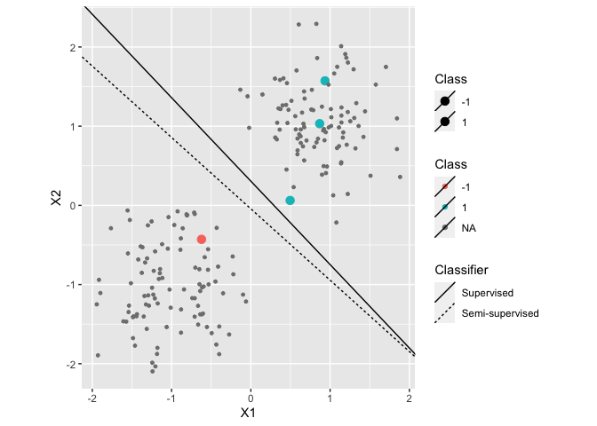

<!-- README.md is generated from README.Rmd. Please edit that file -->
<!-- badges: start -->

[](https://CRAN.R-project.org/package=RSSL)
[](https://travis-ci.org/jkrijthe/RSSL)
[](https://github.com/jkrijthe/RSSL/actions)
[](https://cran.r-project.org/package=RSSL)
[](https://app.codecov.io/gh/jkrijthe/RSSL?branch=master)
<!-- badges: end -->

# R Semi-Supervised Learning package

This R package provides implementations of several semi-supervised
learning methods, in particular, our own work involving constraint based
semi-supervised learning.

To cite the package, use either of these two references:

-   Krijthe, J. H. (2016). RSSL: R package for Semi-supervised Learning.
    In B. Kerautret, M. Colom, & P. Monasse (Eds.), Reproducible
    Research in Pattern Recognition. RRPR 2016. Lecture Notes in
    Computer Science, vol 10214. (pp. 104–115). Springer International
    Publishing. <https://doi.org/10.1007/978-3-319-56414-2_8>. arxiv:
    <https://arxiv.org/abs/1612.07993>
-   Krijthe, J.H. & Loog, M. (2015). Implicitly Constrained
    Semi-Supervised Least Squares Classification. In E. Fromont, T. de
    Bie, & M. van Leeuwen, eds. 14th International Symposium on Advances
    in Intelligent Data Analysis XIV (Lecture Notes in Computer Science
    Volume 9385). Saint Etienne. France, pp. 158-169.

# Installation Instructions

This package available on CRAN. The easiest way to install the package
is to use:

``` r
install.packages("RSSL")
```

To install the latest version of the package using the devtools package:

``` r
library(devtools)
install_github("jkrijthe/RSSL")
```

# Usage

After installation, load the package as usual:

``` r
library(RSSL)
```

The following code generates a simple dataset, trains a supervised and
two semi-supervised classifiers and evaluates their performance:

``` r
library(dplyr,warn.conflicts = FALSE)
library(ggplot2,warn.conflicts = FALSE)

set.seed(2)
df <- generate2ClassGaussian(200, d=2, var = 0.2, expected=TRUE)

# Randomly remove labels
df <- df %>% add_missinglabels_mar(Class~.,prob=0.98) 

# Train classifier
g_nm <- NearestMeanClassifier(Class~.,df,prior=matrix(0.5,2))
g_self <- SelfLearning(Class~.,df,
                       method=NearestMeanClassifier,
                       prior=matrix(0.5,2))

# Plot dataset
df %>% 
  ggplot(aes(x=X1,y=X2,color=Class,size=Class)) +
  geom_point() +
  coord_equal() +
  scale_size_manual(values=c("-1"=3,"1"=3), na.value=1) +
  geom_linearclassifier("Supervised"=g_nm,
                  "Semi-supervised"=g_self)
```



``` r

# Evaluate performance: Squared Loss & Error Rate
mean(loss(g_nm,df))
mean(loss(g_self,df))


mean(predict(g_nm,df)!=df$Class)
mean(predict(g_self,df)!=df$Class)
```

# Acknowledgement

Work on this package was supported by Project 23 of the Dutch national
program COMMIT.
